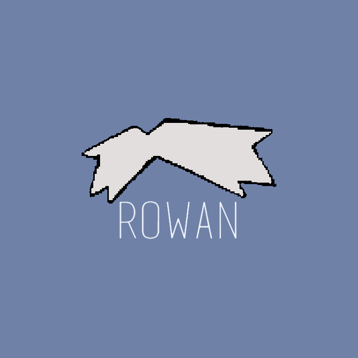

# Rowan
Rowan is a simple pokèdex for android devices where you can search pokèmon by region, id, name, type and much more...  
> Developed in Java

> Data persistence realized using SQLite

  

 

Here some screenshots:  

   &nbsp; &nbsp;
   &nbsp; &nbsp;
   &nbsp; &nbsp;

> [!WARNING] 
> **The first launch of the app will take a few minutes as the database is initializing**  

Work in progress...  

